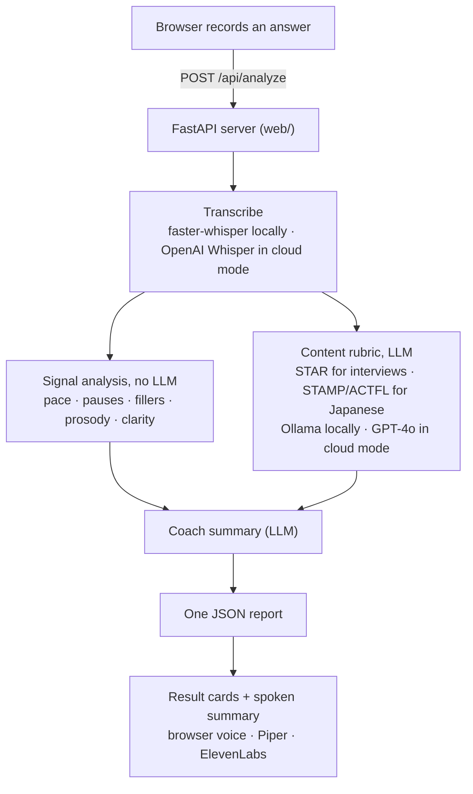

# rehearsal

[](https://github.com/monahand1023/rehearsal/actions/workflows/ci.yml) [](https://github.com/monahand1023/rehearsal/releases) [](https://www.python.org/) [](LICENSE)

A local web app for practicing spoken answers and getting AI feedback — **entirely on your
machine**. Your recording, its transcript, the scoring, and the coaching never leave your
computer; even the coach's spoken voice is your browser's built-in speech by default. No
account, no cloud, no data leaving your device. (Optional higher-quality voices and a cloud
deployment exist — both off by default. See [Privacy](#privacy).)

Two modes, one app:

- **Interview Coach** (English) — record an answer to a behavioral/leadership question; get
  feedback on delivery (pace, pauses, fillers, monotone), clarity, and content — did you
  answer it, your **STAR** structure, and the signals strong answers share (quantified impact,
  ownership, specificity, conciseness) — plus a spoken coaching summary.
- **Japanese Practice** (free-response) — record an answer to a STAMP-style prompt; get the
  same delivery feedback plus an ACTFL-style **proficiency estimate** — a **1–8 STAMP-aligned
  benchmark** with notes on text type, accuracy, and time frames, flags for any English words
  used instead of Japanese, and sentence-structure coaching. A practice estimate, **not** an
  official score.

## Run it

First time — set up the venv, deps, ffmpeg/Ollama check, and pull the model:

```bash
./setup.sh
```

Then start it (or double-click **`rehearsal.command`** in Finder on a Mac):

```bash
./run.sh
```

It checks Ollama and opens the app (default `http://localhost:8742`, auto-bumping if that port
is busy). Pick a **Mode**, pick a **Question**, click the **record orb**, speak, click it again
to **stop**, then **Get feedback**. The coach voice plays through your browser — no setup.

(`make setup`, `make run`, `make docker`, and `make test` are shortcuts for these — run `make` to list them.)

**Or run it all in containers** (app + Ollama, nothing else to install):

```bash
docker compose up -d                                 # builds from source on first run
docker compose exec ollama ollama pull qwen2.5:7b    # one-time model download
open http://localhost:8742
```

The image is built from the current source — no prebuilt image is published. After you change code, rebuild to pick it up: `docker compose up -d --build`.

Overrides:

```bash
REHEARSAL_PORT=9000 ./run.sh
REHEARSAL_LLM_MODEL=qwen2.5:14b-instruct ./run.sh    # richer (slower)
REHEARSAL_TTS_PROVIDER=piper ./run.sh                # local neural voice instead of the browser
```

## Privacy

In the default local setup, **nothing leaves your machine**:

| Stage | Runs on | Leaves your machine? |
|---|---|---|
| Recording → transcript | faster-whisper (local) | **No** |
| Delivery / fillers / prosody | parselmouth (local) | **No** |
| Scoring + coaching (STAMP/STAR, etc.) | Ollama (local) | **No** |
| Coach voice | your browser's Web Speech API | **No** |
| Saved recordings | off by default (no storage) | **No** |

Two **opt-in** features can send data out, and both are off unless you configure them: the
**ElevenLabs** voice (sends only the short coach-summary *text*, never your recording) and the
**cloud deployment** below (uses the OpenAI APIs). For a fully-private install, just don't set
those — the defaults already keep everything on-device.

## How it works



A small FastAPI server with a vanilla-JS frontend, wrapping a standalone analysis engine.
For one answer:

1. **Record** — the browser captures audio and POSTs it to `/api/analyze`.
2. **Transcribe** — Whisper produces a transcript with word timestamps (faster-whisper locally,
   or the OpenAI Whisper API in cloud mode).
3. **Analyze** — the engine runs two kinds of analysis:
   - *signal* (no LLM): speaking rate, pauses, fillers (a lexicon pass + an acoustic voiced-gap
     detector), prosody/monotone via parselmouth, and a clarity proxy.
   - *content* (LLM): the **STAR** rubric for interview answers, or the **STAMP/ACTFL**
     proficiency rubric for Japanese — each returns structured JSON (with a `reasoning` field
     and calibration anchors to keep scoring honest).
4. **Coach** — the LLM writes a short, spoken-style summary (kid-tuned in Japanese mode).
5. **Report** — everything returns as one JSON report; the frontend renders the result cards
   and, optionally, speaks the summary.

**Two providers, one engine.** Each stage is swappable by env var, so the *same code* runs
fully local or on cloud APIs:

| Stage | Local (default) | Cloud "lite" |
|---|---|---|
| Transcription | faster-whisper | OpenAI Whisper API |
| Scoring / coaching | Ollama | OpenAI GPT-4o |
| Prosody / acoustic fillers | parselmouth | *(skipped)* |
| Coach voice | browser / Piper | ElevenLabs |

The `engine/` package has **zero web imports** — it's a standalone library you can test and
reuse on its own — and `web/` is a thin FastAPI + static-frontend layer on top.

```
engine/    # standalone analysis engine: transcribe, delivery, fillers, prosody, clarity,
           # content (STAR), proficiency (STAMP), coach, tts, report, llm
web/       # FastAPI server (app.py), provider seams, + vanilla-JS frontend (static/)
questions/ # question libraries per track (interview_en, language_jp)
scripts/   # gen_test_audio, deploy, put_secrets
tests/     # unit + integration tests, committed audio fixtures, opt-in calibration suites
docs/      # design specs, implementation plans, the deploy runbook
```

## Requirements

Install these first; then `./setup.sh` creates the `.venv` and installs the Python deps:

- **Python 3.11+**
- **ffmpeg** on your PATH (audio decoding) — `brew install ffmpeg` (macOS) / `sudo apt install
  ffmpeg` (Debian/Ubuntu).
- **[Ollama](https://ollama.com)** running, with the model pulled (`ollama pull qwen2.5:7b`) —
  powers the interview/proficiency scoring and the coach summary. Without it, delivery +
  clarity still work but content/coach feedback errors.

The **coach voice** works out of the box via your browser's built-in speech (fully local, no
setup). Optional higher-quality voices: **Piper** (local neural TTS — `pip install piper-tts`
and point `REHEARSAL_PIPER_VOICE_EN` / `_JA` at a downloaded `.onnx`
[voice](https://github.com/rhasspy/piper/blob/master/VOICES.md)) or **ElevenLabs** (cloud — set
`ELEVENLABS_API_KEY`; sends only the short summary text). Force one with
`REHEARSAL_TTS_PROVIDER=browser|piper|elevenlabs` (default `auto`).

## Model choice

The content/proficiency/coach model defaults to **`qwen2.5:7b`** (`REHEARSAL_LLM_MODEL`).
Benchmarked on an M4 Pro against `llama3.1:8b` and `qwen2.5:14b-instruct`: 7B was ~2× faster
and, crucially, actually reads Japanese (llama3.1 hallucinated grammar errors on clean
Japanese). `qwen2.5:14b-instruct` gives richer coaching and better scoring at ~2× the latency —
it passes **7 of 8** of the STAMP calibration set within one level locally. Run the calibration
suites (see Testing) against your own model to check before relying on the scores.

## Testing

```bash
.venv/bin/pytest -q                          # full suite (~190 tests; opt-in live suites skip)
.venv/bin/pytest -k "not ollama" -q          # skip the slow local LLM end-to-end tests
```

CI runs the keyless suite on every push (ffmpeg + faster-whisper, no Ollama, no API keys).
Integration tests run the real engine on committed audio fixtures (`tests/fixtures/generated/`,
keyless at test time). Three **opt-in** suites validate quality against a live model — they
skip by default and run against whatever `REHEARSAL_LLM_PROVIDER` points at (local Ollama by
default, or OpenAI with a key):

```bash
# validate your local model's scoring calibration:
REHEARSAL_RUN_CALIBRATION=1 .venv/bin/pytest tests/test_calibration.py tests/test_interview_calibration.py
# end-to-end feature checks (cloud-oriented):
REHEARSAL_RUN_E2E=1 REHEARSAL_LLM_PROVIDER=openai OPENAI_API_KEY=sk-... .venv/bin/pytest tests/test_e2e_cloud.py
```

Regenerate the audio fixtures with `scripts/gen_test_audio.py` (needs an ElevenLabs key).

## Known limitations

- **Filler detection** — the weakest component. Whisper deletes most fillers from the
  transcript, and the acoustic detector (native mode only) favors precision over recall. See
  `docs/superpowers/fillers-spike.md`; saved recordings can be reprocessed offline with
  `python -m web.reprocess`.
- **Scoring quality scales with the model.** The rubrics were tuned on a strong model; a small
  local model still produces valid output but scores less accurately. Use a more capable
  `REHEARSAL_LLM_MODEL` (e.g. `qwen2.5:14b-instruct`) and validate with the calibration suites.
- **Japanese pace** is reported in characters/minute (words/minute is meaningless under
  Whisper's per-character Japanese tokenization).
- **Proficiency** is an LLM practice estimate, not an official STAMP score.

## Deploy to AWS (optional)

Host it serverless (Lambda + Function URL). One-time secret setup, then redeploy anytime:

```bash
# 1. store your secrets in SSM (once) — OPENAI_API_KEY + a gate code are required
OPENAI_API_KEY='sk-...' ACCESS_CODE='<long random code>' make secrets
#    ELEVENLABS_API_KEY=... is optional — the cloud falls back to the browser voice without it

# 2. build + deploy (prints the app URL when done)
make deploy
```

Needs the AWS CLI + [SAM CLI](https://docs.aws.amazon.com/serverless-application-model/latest/developerguide/install-sam-cli.html) + configured credentials — `make deploy` checks all three and tells you what's missing. The stack runs the **cloud "lite"** providers (OpenAI Whisper + GPT-4o), an access-code gate, reserved concurrency, and an encrypted recordings bucket. Region defaults to `us-west-2` (override with `AWS_REGION`); stack name with `REHEARSAL_STACK`. Full runbook + cost guards: `docs/superpowers/DEPLOY.md`.

## Cloud providers (for hosting)

By default everything runs locally (faster-whisper + Ollama). To run without local
models — e.g. on a server — set:

| Env var | Values | Effect |
|---|---|---|
| `REHEARSAL_TRANSCRIBE_PROVIDER` | `local` (default) / `openai` | Whisper via faster-whisper vs the OpenAI Whisper API |
| `REHEARSAL_LLM_PROVIDER` | `ollama` (default) / `openai` | rubric/coach via Ollama vs OpenAI |
| `REHEARSAL_LLM_MODEL` | (optional) | overrides the provider's default model |
| `OPENAI_API_KEY` | — | required when either provider is `openai` |

With both set to `openai`, the engine needs neither `faster-whisper` nor `ollama`
installed (`requirements-cloud.txt`); parselmouth + ElevenLabs are unchanged.
Note: the OpenAI Whisper API returns word timestamps but no per-word confidence, so
the clarity proxy is less precise on the cloud provider.

## Access code (optional gate)

The app is open by default (local use). Set `REHEARSAL_ACCESS_CODE` to require a shared
code before anyone can use it — a gate page exchanges the code for a signed, HttpOnly cookie
(~30 days). Used for the hosted deployment so only people with the code can get in.

| Env var | Default | Meaning |
|---|---|---|
| `REHEARSAL_ACCESS_CODE` | (unset → gate off) | the shared secret code (use a long random one) |
| `REHEARSAL_SESSION_SECRET` | dev default | signs the cookie — set a real random value when hosting |
| `REHEARSAL_UNLOCK_DELAY` | `3.0` | seconds to wait after a wrong code (brute-force friction) |
| `REHEARSAL_COOKIE_SECURE` | `false` | set `true` when served over HTTPS |

Brute force is resisted primarily by a high-entropy code; the delay + a deploy-time Lambda
concurrency cap are defense-in-depth.
